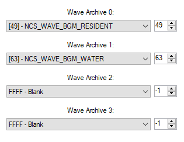
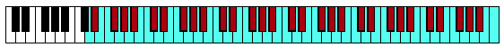
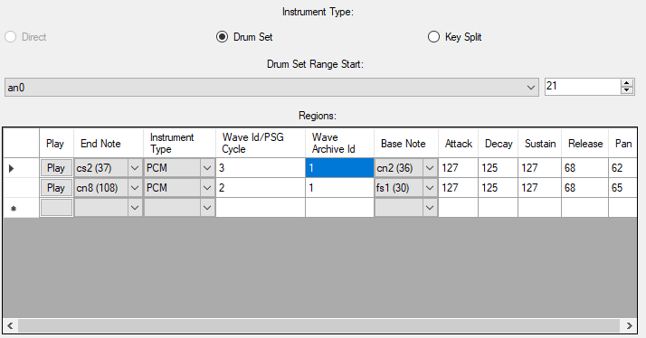
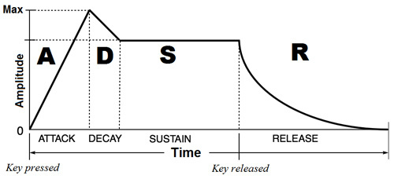
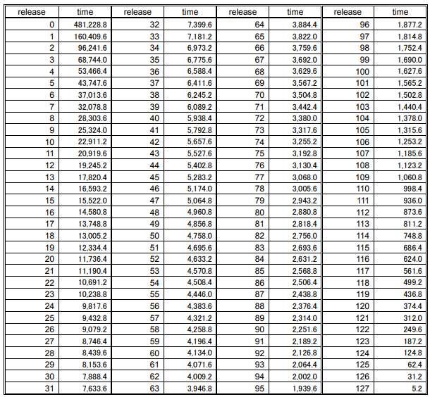
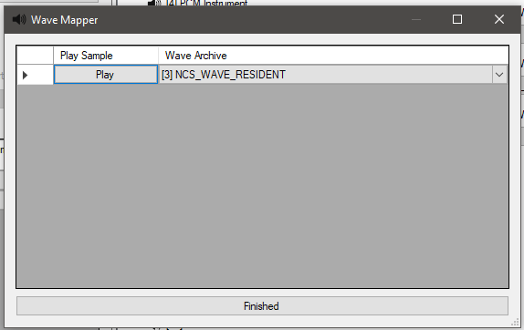

# Bank Editor
The Bank Editor is used to edit Banks. The Bank Editor adds a few new parts to the window. Each instrument index plus one corresponds to its MIDI program number

## New Window Additions
This section covers the new items added to the window. However, these rely on the parent Sound Archive. These items will only appear if a Sound Archive is opened in the Main Window.

### Wave Archive List
The Wave Archive List shows what Wave Archives are hooked up to the Bank. If the list is modified for the sake of emulation, it will not change the Wave Archives hooked up to the Bank in the Sound Archive, as the Wave Archive list is just for previewing.

Wave Archive 0 - What Wave Archive to use when a Region's Wave Archive Id is 0.

Wave Archive 1 - What Wave Archive to use when a Region's Wave Archive Id is 1.

Wave Archive 2 - What Wave Archive to use when a Region's Wave Archive Id is 2.

Wave Archive 3 - What Wave Archive to use when a Region's Wave Archive Id is 3.

### Piano
The piano can be used to preview an instrument. It has different colors for each Region within the instrument.

## Instrument Info
Each instrument has info that tells the Bank what type of instrument it is, and has information for each Region contained within it.

### Instrument Type
An instrument can be one of three main types: Direct, Drum Set, or Key Split. Nitro Studio 2 will only let you use a type of instrument allowed by the intrument's current list of Regions.

#### Direct Instrument
A Direct instrument contains exactly one Region that spans the entire keyboard.

#### Drum Set
A Drum Set contains Regions for sections of the keyboard.

#### Key Split
A Key Split instrument is like a Drum Set, but the first Region must start from note 0, and this instrument can only have 8 Regions maximum.

### Drum Set Range Start
If the instrument is a Drum Set, the first Region will start from this note.

### Regions
A Region is a section of the keyboard that tells the Sequence Player how to play a note. A Region starts from the previous Region's end note plus one, and ends at the Regions end note. If it is the first Region, the Region will start at 0, or start at what the Drum Set Range Start has set if the instrument is a Drum Set. For example, A list of Regions with the end notes 40, 59, and 127 defines 3 Regions: one from note 0 to 40, another from note 41 to 59, and one last one from 60 to 127. Note that if the instrument is a Drum Set and the Drum Set Range Start was nonzero, that would be where the first Region starts from. When a note is played, it will look for the Region containing that note and get the playback info for that note.

End Note - The last note the Region consists of.

Instrument Type - PCM means that the note will use a Wave sample from a linked Wave Archive. PSG will play an 8-bit noise. Noise will play white noise. Direct PCM was a dropped type and shouldn't be used. Null plays no sound.

Wave Id / PSG Cycle - If the instrument is a PCM instrument, this is the Wave id in the linked Wave Archive. If it is a PSG instrument, this is the duty cycle.

Wave Archive Id - If the instrument is a PCM instrument, this will be the index in the Wave Archive List to get the Wave data from.

Base Note - The original key the Wave sample was recorded in.

Attack - Attack value. See envelope for more info.

Decay - Decay value. See envelope for more info.

Sustain - Sustain value. See envelope for more info.

Release - Release value. See envelope for more info.

Pan - Shift the audio to the left or right, where 64 is the middle, 0 is the left, and 127 is the right.

#### Envelope
An envelope is used to modify how the volume of notes change over time. Here is a chart that visualizes the process:

Attack - How long it takes to reach the maximum note velocity.

Decay - How long it takes from the maximum velocity to reach the sustain velocity.

Sustain - Velocity for the note to sustain at.

Release - How long it takes from the sustain velocity to get silence.

##### Attack Chart
A chart that converts an attack value to a time in milliseconds.

##### Decay/Release Chart
A chart that converts a decay/release value to a time in milliseconds, assuming that sustain is it a maximum.

## Exporting/Replacing Instruments
Instruments can be exported and replaced by using custom formats used by Nitro Studio 2. Using NS2I will contain audio sample data in the instrument, while a NIST file does not. Exporting them is fairly straight forward.

When you replace an instrument with a NS2I file, for each audio sample in the NS2I, it will look through all of the Wave Archives in the Wave Archive List, and see if any of the Wave Archives contains that sample. If not, it will prompt you to choose which linked Wave Archive to save the audio sample to.

# Next
Now that you know how to edit Banks, it's time to move on to:

[Wave Archive Editor](waveArchiveEditor.md)