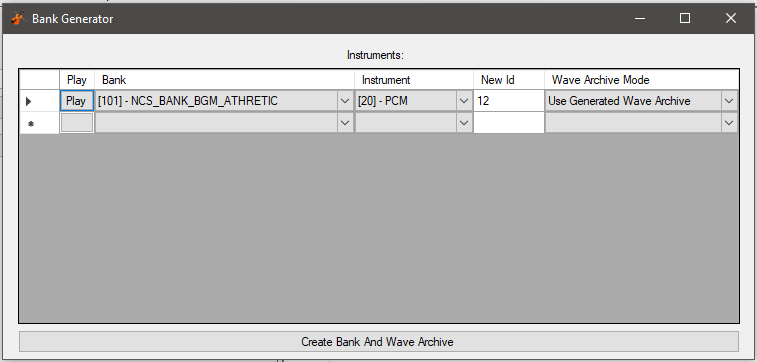

# Bank Generator
The Bank Generator Tool is a tool that allows you to create a new Bank from instruments from other Banks.

## Play
The play button will play middle C for a half note of the instrument that will be added to the new Bank.

## Bank
The Bank to copy the instrument from. This list will only contain Banks that include at least one instrument.

## Instrument
The instrument index inside of the source Bank to copy to the new Bank.

## New Id
What new program number to assign the instrument in the new Bank.

## Wave Archive Mode
This dictates how the instrument's audio data should be stored.

Use Generated Wave Archive - Add the Wave files to a Wave Archive created along with the new Bank.

Use Existing Wave Archive - Link the Bank to the Wave Archive storing the samples instead.

## Create Bank And Wave Archive
Create a new Bank and Wave Archive from the instruments listed above. A new Wave Archive is only created when an instrument is selected to have its samples stored inside the generated Wave Archive. If there are more than 4 Wave Archives being used by the new Bank, a Bank can not be generated. To reduce this, have more instruments use the generated Wave Archive for storing samples.

# Next
Now that you know how to generate Banks, it's time to move on to:

[Wave Creator](waveCreator.md)