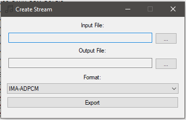

# Stream Creator
The Stream Creator is used to create Stream files.

## Input File
File to convert to a Stream. Note that converting from an IMA-ADPCM Wave is lossy.

## Output File
Where to save the Stream.

## Format
The encoding format for the destination Stream. IMA-ADPCM is the most efficient.

# Next
Now that you know how to create Streams, it's time to move on to:

[DLS/SF2 Importer](sf2DlsImporter.md)