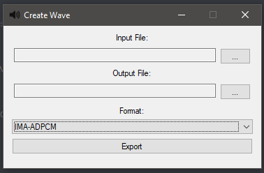

# Wave Creator
The Wave Creator is used to create Wave files.

## Input File
File to convert to a Wave. Note that converting from an IMA-ADPCM Stream is lossy.

## Output File
Where to save the Wave.

## Format
The encoding format for the destination Wave. IMA-ADPCM is the most efficient.

# Next
Now that you know how to create Waves, it's time to move on to:

[Stream Creator](streamCreator.md)